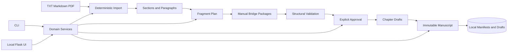

# Erdya

## Structured Translation Workflow and Manuscript Assembly System

Erdya is a local-first application for converting source documents into a
controlled, reviewable translation workflow and an integrity-verified manuscript.

The production repository and book content remain private. This repository
documents the verified architecture, engineering process and working product.

## What the system does

- imports TXT, Markdown and PDF documents
- reconstructs sections and paragraph boundaries deterministically
- plans translation fragments with controlled context
- generates structured Manual Bridge packages for external language models
- validates returned translations against paragraph identifiers
- requires explicit approval before assembling chapter drafts
- assembles approved chapters into an immutable manuscript draft
- records manifests and SHA-256 hashes for integrity verification
- provides both a command-line interface and a local Flask dashboard

## Architecture

## Engineering priorities

- deterministic reconstruction of source structure
- explicit human approval boundaries
- durable writes, locking and recovery behaviour
- manifest linkage and historical integrity
- idempotent manuscript assembly
- protection against accidental automatic publication
- shared domain logic for CLI and web interfaces
- regression testing across complete workflows

## Verified evidence

- package version: `0.4.0c0`
- 214 automated unit and integration tests
- 9 subprocess CLI tests
- browser acceptance completed on a synthetic workspace
- manuscript verification checks recorded SHA-256 integrity
- repeated assembly of unchanged state returns the same version
- local web mutations protected by CSRF and origin checks

## Development approach

Erdya was designed and delivered over two intensive development days using
AI-assisted software development.

My responsibilities included product definition, requirements, architecture
decisions, agent coordination, acceptance testing, browser verification and
approval of stable Git checkpoints. AI agents accelerated implementation while
the completed workflow was verified against explicit acceptance criteria.

## Technology

Python 3.12, Flask, command-line tooling, Jinja, JavaScript, local file storage,
SHA-256 manifests, automated testing, Git and Linux.

## Current boundaries

Erdya is currently a local, single-user tool. It does not automatically call
language-model APIs or publish completed text. Mobile acceptance and manuscript
versioning beyond the first immutable draft remain outside the current release.

## Source availability

The application source code, translation workspaces and copyrighted book content
are private. Product screenshots and additional workflow demonstrations will be
published here separately.
